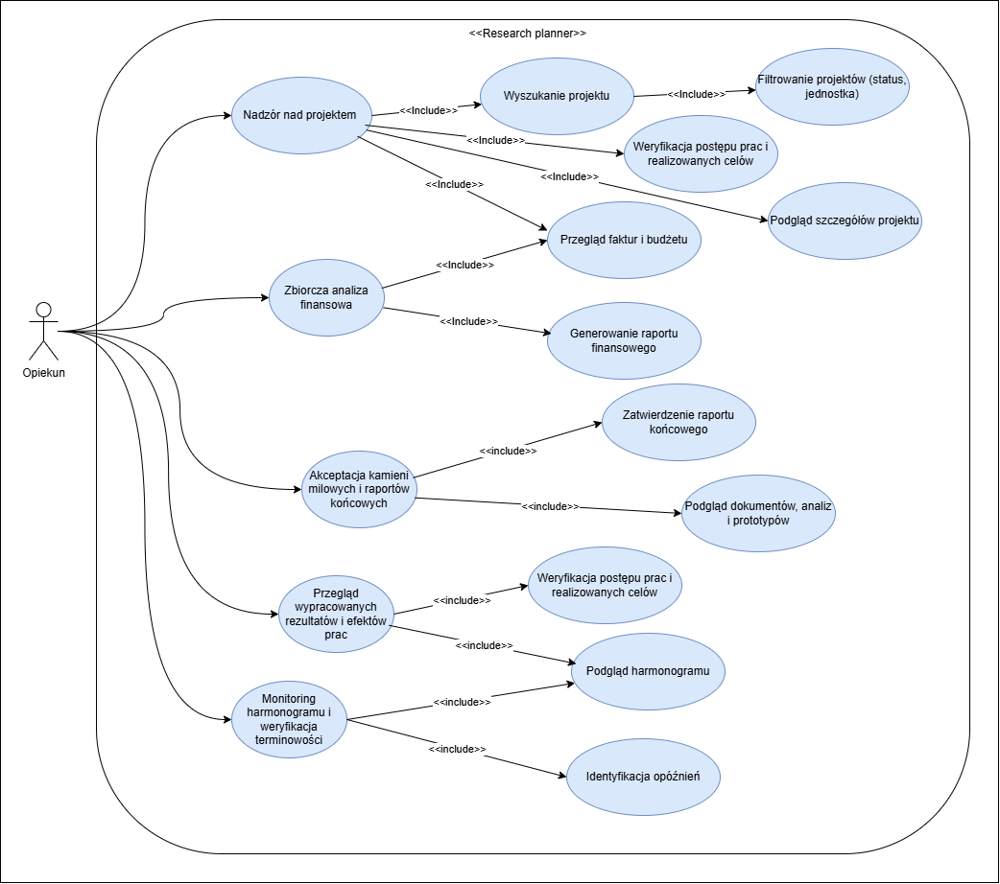

# Analiza Wymagań

## 1. Interesariusze

| L.p. | Interesariusz      | Opis                                                                                              |
|------|--------------------|---------------------------------------------------------------------------------------------------|
| 1.   | Opiekun            | Koncentruję się na strategicznym nadzorze i analizie wyników.                                     |
| 2.   | Kierownik projektu | Główny planista i osoba odpowiedzialna za merytoryczną oraz finansową stronę konkretnego badania. |
| 3.   | Lider zespołu      | Osoba zarządzająca ludźmi i koordynująca codzienne działania badawcze.                            |
| 4.   | Członek zespołu    | Bezpośredni wykonawca zadań, odpowiedzialny za dostarczanie merytorycznego wkładu w projekt.      |
| 5.   | Księgowa           | Osoba odpowiedzialna za poprawność finansową, rozliczenia oraz zgodność z przepisami.             |

## 2. Wymagania funkcjonalne 

### Opiekun

- **(Wymagene) Nadzór nad realizowanym projektem** Możliwość monitorowania realizowanego projektu w systemie.

- **(Wymagene) Podgląd wyników** Dostęp do podglądu wypracowanych rezultatów i efektów prac dostarczanych przez zespoły.

- **(Wymagene) Monitoring harmonogramów** Wgląd w harmonogramy projektu w celu weryfikacji terminowości kluczowych etapów realizacji projektu.

- **(Wymagene) Akceptacja kamieni milowych i raportów** Podgląd i zatwierdzanie przed wysłaniem do instytucji finansujących (np. grantodawców).

### Kierownik projektu

- **(Wymagene) Zarządzanie strukturą prac** Dodawanie, edycja oraz usuwanie zadań w ramach struktury projektu.

- **(Wymagene) Planowanie czasowe** Tworzenie i modyfikacja harmonogramu projektu.

- **(Wymagene) Zarządzanie zapotrzebowaniem** Składanie wniosków o zakup sprzętu/materiałów i materiałów niezbędnych do realizacji projektu. Przesyłanie zamówień do księgowości w celu akceptacji.

- **(Wymagene) Raportowanie operacyjne** Generowanie raportów realizacji projektu w określonych zakresach czasowych.

### Lider zespołu

- **(Wymagene) Dodawanie członków zespołów** System umożliwia dodawanie, edycje i usuwanie członków zespołów.

- **(Wymagene) Formowanie zespołów** Tworzenie grup roboczych oraz przypisywanie do nich odpowiednich pracowników.

- **(Wymagene) Zarządzanie strukturą prac i delegowanie zadań** Dodawanie, edycja, usuwanie podzadań oraz przydzielanie konkretnych podzadań członkom zespołu.

- **(Średni) Kontrola operacyjna** Bieżący podgląd statusu realizacji zadań przez podległych pracowników

- **(Wymagene) Komunikacja wewnętrzna** Prowadzenie sprawnej wymiany informacji między członkami projektu za pomocą systemu.

- **(Wymagene) Raportowanie uzyskanych wyników** Dodawanie, edycja oraz usuwanie uzyskanych wyników.

- **(Wymagene) Zarządzanie zapotrzebowaniem** Składanie wniosków o zakup sprzętu i materiałów niezbędnych do realizacji projektu.

### Księgowa

- **(Wymagene) Planowanie budżetowe** Wprowadzanie budżetu i precyzyjny podział środków na kategorie kosztowe.

- **(Wymagene) Monitoring budżetu** Stały podgląd aktualnego stanu budżetu, przydziału środków oraz ich wykorzystania.

- **(Wymagene) Zarządzanie dokumentacją kosztową** Rejestrowanie faktur i przypisywanie ich do odpowiednich projektów badawczych, kategorii kosztowych.

- **(Wymagene) Realizacja płatności** Obsługa procesów rozliczania i opłacania zweryfikowanych faktur.

- **(Wymagene) Weryfikacja finansowa zamówień** Sprawdzanie dostępności środków w budżecie przed ostateczną akceptacją zapotrzebowania na sprzęt

- **(Wymagene) Analiza finansowa** Generowanie zbiorczych raportów kosztów dla wybranego projektu.

### Członek zespołu

- **(Wymagene) Raportowanie postępów:** Przesyłanie wyników wykonanej pracy oraz aktualizacja statusów przypisanych podzadań.

- **(Wymagene) Obsługa powiadomień:** System umożliwia automatyczne generowanie komunikatów o nadchodzących terminach i zmianach w zadaniach.

- **(Wymagene) Wymiana informacji:** System zapewnia korzystanie z modułów komunikacyjnych do współpracy z innymi uczestnikami projektu.

- **(Średni) Rejestrowania czasu:** Możliwość rejestrowania czasu pracy (time-tracking) poświęconego na konkretne eksperymenty lub analizy w ramach projektu.

## 3. Wymagania niefunkcjonalne 

| L.p. | Opis                                                                                                                                                                                                                                               |
|------|----------------------------------------------------------------------------------------------------------------------------------------------------------------------------------------------------------------------------------------------------|
| 1    | **Dostępność i niezawodność** – System powinien być dostępny w trybie 24/7                                                                                                                                                                         |
| 2    | **Wydajność** - System musi reagować na akcje użytkownika w czasie poniżej 1 sekundy                                                                                                                                                               |
| 3    | **Szyfrowanie** – Wszystkie dane muszą być szyfrowane zarówno podczas przesyłania (protokół TLS/SSL)                                                                                                                                               |
| 4    | **Ochrona przed nieautoryzowanym dostępem** – System musi blokować dostęp do wrażliwych modułów (finanse, zamówienia) osobom bez odpowiednich uprawnień                                                                                            |
| 5    | **Skalowalność** – Architektura musi pozwalać na łatwe rozszerzanie zasobów (np. obsługę większej liczby projektów) oraz dodawanie nowych funkcjonalności bez konieczności przebudowy fundamentów systemu                                          |
| 6    | **Zgodność z prawem** – System musi być w pełni zgodny z RODO w zakresie ochrony danych osobowych oraz z przepisami prawa finansowego                                                                                                              |
| 7    | **Standardy WCAG** –  Interfejs użytkownika (UI) musi być zaprojektowany zgodnie z wytycznymi WCAG, aby umożliwić komfortową pracę osobom z różnymi niepełnosprawnościami                                                                          |
| 8    | **Standardy architektoniczne** – Kod i struktura systemu powinny ułatwiać rozwój i konserwację                                                                                                                                                     |
| 9    | **Reakcja na brak danych:** – W sytuacjach, gdy dane w wybranym zakresie nie istnieją lub są niekompletne, system nie może wygenerować pustego błędu, lecz musi poinstruować użytkownika o konieczności zmiany zakresu lub uzupełnienia informacji |

# 4. Specyfikacja przypadków użycia

## 1. Aktor: Opiekun

### Nadzór nad realizowanym projektem.
*   **Aktorzy:** Opiekun/Dyrektor
*   **Warunki początkowe:** Użytkownik zalogowany z uprawnieniami.
*   **Scenariusz główny:**
1. Użytkownik wybiera moduł „Podgląd Projektów”.
2. System wyświetla listę wszystkich realizowanych projektów wraz z ich statusami.
3. Użytkownik filtruje projekty według statusu lub jednostki.
4. Użytkownik może wyświetlić szczegóły realizowanego projetku.
5. Użytkownik może przeglądać faktury i pozostały budżet.
6. Użytkownik przegląda harmonogram i zaplanowane zadania.
6. Użytkownik może weryfikować postęp prac i osignięte cele.
*   **Scenariusze alternatywne:**
*   A1: Brak projektów w systemie → System wyświetla komunikat o braku realizowanych projektów.
*   A2: Brak uprawnień do podglądu projektu → System wyświetla informacje o braku uprawnień.

### Akceptacja kamieni milowych i raportów końcowych
*   **Aktorzy:** Opiekun/Dyrektor
*   **Warunki początkowe:** Kierownik projektu przedłożył raport lub kamień milowy do zatwierdzenia.
*   **Scenariusz główny:**
1. Użytkownik otwiera powiadomienie o oczekującej akceptacji.
2. Użytkownik przegląda rezultaty prac i efekty dostarczone przez zespół.
3. Użytkownik zatwierdza raport końcowy.
4. System zmienia status na „Zatwierdzony” i przygotowuje dane do wysyłki do instytucji finansującej.

###  Podgląd wyników
*   **Aktorzy:** Opiekun/Dyrektor
*   **Warunki początkowe:**
*   Użytkownik jest zalogowany do systemu.
*   Członkowie zespołów przesłali wyniki prac lub aktualizacje statusów w swoich projektach.
*   **Scenariusz główny:**
1. Użytkownik wybiera moduł „Rezultaty Projektów”.
2. System wyświetla listę projektów z informacją o najnowszych dostarczonych efektach (np. dokumentacja, analizy, prototypy).
3. Użytkownik wybiera konkretny projekt, aby przejrzeć szczegółowe wypracowane rezultaty.
4. System wyświetla podgląd plików lub opisów dostarczonych przez zespoły.
*   **Scenariusze alternatywne:**
*   A1: Brak przesłanych rezultatów dla wybranego okresu → System wyświetla komunikat o braku danych i instruuje użytkownika o konieczności zmiany parametrów wyszukiwania.
*   A2: Próba otwarcia pliku o dużym rozmiarze → System zapewnia reakcję interfejsu w czasie poniżej 1 sekundy (poprzez wyświetlenie paska postępu pobierania).

### Monitoring harmonogramów
*   **Aktorzy:** Opiekun/Dyrektor
*   **Warunki początkowe:**
*   Użytkownik jest zalogowany do systemu.
*   Kierownicy projektów utworzyli harmonogramy i zdefiniowali kluczowe etapy (kamienie milowe).
*   **Scenariusz główny:**
1. Użytkownik wybiera moduł „Monitoring Harmonogramów”.
2. System wyświetla widok zbiorczy (np. wykres Gantta lub listę kamieni milowych) dla projektu.
3. Użytkownik filtruje widok, aby zidentyfikować zadania z zagrożonymi terminami lub opóźnieniami w kluczowych etapach.
4. System wyróżnia etapy, których termin realizacji upłynął bez zmiany statusu na „Zakończone”.
5. Użytkownik weryfikuje stopień zaawansowania prac w stosunku do planu.
*   **Scenariusze alternatywne:**
*   A1: Harmonogram projektu nie został jeszcze zdefiniowany → System informuje użytkownika, że Kierownik Projektu nie wprowadził jeszcze planu czasowego.
*   A2: Brak uprawnień do szczegółowego harmonogramu wrażliwego projektu → System blokuje dostęp i wyświetla informację o braku odpowiednich uprawnień.

---

## 2. Aktor: Kierownik Projektu

### Zarządzanie strukturą prac
*   **Aktorzy:** Kierownik projektu
*   **Warunki początkowe:**
*   Użytkownik zalogowany do systemu.
*   Projekt został zainicjowany w systemie.
*   **Scenariusz główny:**
1. Użytkownik wybiera moduł zarządzania projektem.
2. Użytkownik dodaje, edytuje lub usuwa zadania w strukturze projektu.
3. Użytkownik definiuje ramy czasowe dla zadań, tworząc lub modyfikując harmonogram.
4. System aktualizuje widok struktury prac i plan czasowy.
*   **Scenariusze alternatywne:**
*   A1: Błędne daty (np. zakończenie przed rozpoczęciem) → System wyświetla komunikat o błędzie i nie zapisuje zmian.
*   A2: Brak uprawnień do edycji struktury → System blokuje dostęp do modułu.

### Zarządzanie zapotrzebowaniem
*   **Aktorzy:** Kierownik projektu
*   **Warunki początkowe:**
*   Użytkownik zalogowany, posiada uprawnienia do weryfikacji zamówień.
*   Istnieje zapotrzebowanie zgłoszone przez zespół lub potrzeba zakupu sprzętu.
*   **Scenariusz główny:**
1. Użytkownik składa wniosek o zakup sprzętu lub materiałów niezbędnych do realizacji zadań.
2. Użytkownik przechodzi do modułu „Zamówienia” i przegląda szczegóły oczekujących wniosków.
3. Użytkownik weryfikuje statusy złożonych zamówień w ramach posiadanych uprawnień.
4. Użytkownik składa wnioseku o realizacje zamówienia.
5. System aktualizuje status zamówienia i powiadamia zainteresowane osoby (lidera zespołu, kieorwnika).
*   **Scenariusze alternatywne:**
*   A1: Brak środków w danej kategorii budżetowej → System blokuje akceptację i wyświetla informację o braku funduszy.
*   A2: Księgowa odrzuca zamówienie → Księgowa wprowadza przyczynę odrzucenia wniosku zamówienia → System powiadamia kierownika o odrzuceniu wniosku z zamówieniem podając przyczynę.

### Raportowanie operacyjne
*   **Aktorzy:** Kierownik projektu
*   **Warunki początkowe:**
*   W systemie zarejestrowano postępy prac lub wydatki.
*   **Scenariusz główny:**
1. Użytkownik wybiera funkcję generowania raportów.
2. Użytkownik określa zakres czasowy oraz zakres raportu z postępu realizacji
3. System generuje raport ze zadan które były zaplanowane na ten czas i ich realizacji.
*   **Scenariusze alternatywne:**
*   A1: Brak danych w wybranym zakresie → System  instruuje użytkownika o konieczności zmiany zakresu dat.

### Raportowanie operacyjne
*   **Aktorzy:** Kierownik projektu
*   **Warunki początkowe:**
*   Użytkownik zalogowany, posiada uprawnienia tworzenie i modyfikacja harmonogramu projektu.
*   **Scenariusz główny:**
1. Użytkownik wybiera funkcję tworzenia harmonogramu .
2. Użytkownik dodaje etapy trwania projektu oraz definiowaniuje daty ich trwania i zależności pomiędzy nimi.
3. Użytkownik wyszukuje zadania i przypisuje je do poszczególnych etapów projektu.
*   **Scenariusze alternatywne:**
*   A1: Brak danych w wybranym zakresie → System instruuje użytkownika o konieczności zmiany zakresu dat.
*   A2: Brak nieprzypisanych zadań → System informuje o braku zadań do przypisania.
*   A3: Data rozpoczęcia jest po dacie końca etapu → System informuje o nieprawidłowym zakresie dat.

---

#### 3. Aktor: Lider Zespołu

##### Dodawanie członków zespołów
*   **Aktorzy:** Lider zespołu.
*   **Warunki początkowe:**
    *   Użytkownik jest zalogowany do systemu.
    *   W systemie dostępna jest baza pracowników wraz z ich kwalifikacjami.
    *   Istnieje utworzona grupa robocza lub projekt.
*   **Scenariusz główny:**
    1. Użytkownik wybiera moduł **„Zarządzanie Zespołem”**.
    2. Użytkownik wybiera opcję zarządzania składem osobowym konkretnej grupy.
    3. Użytkownik wykonuje akcję **dodania, edycji lub usunięcia członka** z danego zespołu.
    4. W przypadku dodawania, użytkownik wyszukuje odpowiednich pracowników w bazie (np. filtrując według kompetencji) i przypisuje ich do grupy.
    5. System zapisuje aktualny skład zespołu i **automatycznie aktualizuje uprawnienia** członków w ramach projektu.
*   **Scenariusze alternatywne:**
    *   A1: **Brak dostępnych pracowników** o wymaganych kompetencjach → System wyświetla instrukcję o konieczności aktualizacji bazy kwalifikacji.
    *   A2: **Brak danych** w wybranym zakresie wyszukiwania → System instruuje użytkownika o konieczności zmiany parametrów (zgodnie z ogólną zasadą obsługi błędów).

##### Formowanie zespołów
*   **Aktorzy:** Lider zespołu.
*   **Warunki początkowe:**
    *   Użytkownik jest zalogowany do systemu.
    *   W systemie dostępna jest baza pracowników wraz z ich kwalifikacjami.
*   **Scenariusz główny:**
    1. Użytkownik wybiera moduł **„Zarządzanie Zespołem”**.
    2. Użytkownik tworzy nową grupę roboczą przypisaną do konkretnego projektu.
    3. Użytkownik wyszukuje odpowiednich pracowników i przypisuje ich do grupy (dodawanie członków).
    4. System zapisuje skład zespołu i aktualizuje uprawnienia członków.
*   **Scenariusze alternatywne:**
    *   A1: **Brak dostępnych pracowników** o wymaganych kompetencjach → System wyświetla instrukcję o konieczności aktualizacji bazy kwalifikacji.

##### Zarządzanie strukturą prac i delegowanie zadań
*   **Aktorzy:** Lider zespołu.
*   **Warunki początkowe:** Istnieje aktywny projekt z określoną strukturą prac.
*   **Scenariusz główny:**
    1. Użytkownik otwiera moduł **„Struktura Prac”**.
    2. Użytkownik dodaje nowe podzadania, edytuje istniejące lub usuwa zbędne elementy.
    3. Użytkownik **przydziela konkretne zadania** (delegowanie odpowiedzialności) do poszczególnych członków zespołu.
    4. System przesyła automatyczne powiadomienie do pracownika o nowym zadaniu.
*   **Scenariusze alternatywne:**
    *   A1: Próba przypisania zadania osobie spoza zespołu → System blokuje akcję i wyświetla komunikat o braku uprawnień.
    *   A2: Brak podzadań do przydzielenia → System informuje o braku wolnych zadań.

##### Kontrola operacyjna
*   **Aktorzy:** Lider zespołu.
*   **Warunki początkowe:** Członkowie zespołu raportują postępy w swoich zadaniach.
*   **Scenariusz główny:**
    1. Użytkownik wybiera widok **„Kontrola Operacyjna”**.
    2. System wyświetla bieżący status realizacji wszystkich zadań podległych pracowników w czasie rzeczywistym,.
    3. System zapewnia reakcję interfejsu w czasie **poniżej 1 sekundy**.
    4. Użytkownik weryfikuje stopień zaawansowania prac merytorycznych.
*   **Scenariusze alternatywne:**
    *   A1: **Brak zaraportowanych postępów** w wybranym okresie → System instruuje o braku danych od zespołu.

##### Komunikacja wewnętrzna
*   **Aktorzy:** Lider zespołu, Członek zespołu.
*   **Warunki początkowe:** Użytkownicy są przypisani do tego samego projektu.
*   **Scenariusz główny:**
    1. Użytkownik inicjuje wymianę informacji poprzez systemowy **moduł komunikacyjny**,.
    2. Użytkownik przesyła wiadomość lub instrukcje do członka zespołu.
    3. Odbiorca otrzymuje powiadomienie o nowej wiadomości.
*   **Scenariusze alternatywne:**
    *   A1: Błąd wysyłki → System wyświetla komunikat o błędzie.

##### Raportowanie uzyskanych wyników
*   **Aktorzy:** Lider zespołu,.
*   **Warunki początkowe:** Wypracowano rezultaty prac badawczych.
*   **Scenariusz główny:**
    1. Użytkownik wybiera funkcję raportowania wyników.
    2. Użytkownik **dodaje, edytuje lub usuwa** wypracowane rezultaty prac (np. dokumentację, analizy),.
    3. System zapisuje dane i udostępnia je w module „Rezultaty Projektów” dla Opiekuna.

##### Składanie wniosków o zapotrzebowanie
*   **Aktorzy:** Lider zespołu,.
*   **Warunki początkowe:** Istnieje potrzeba zakupu sprzętu lub materiałów do realizacji projektu,.
*   **Scenariusz główny:**
    1. Użytkownik składa własny **wniosek o zakup sprzętu lub materiałów**,.
    2. System przesyła wniosek do dalszej akceptacji finansowej, analogicznie do procesu kierownika projektu.
    3. System przekazuje wniosek do dalszej weryfikacji finansowej przez kierownika projektu i księgową.
*   **Scenariusze alternatywne:**
    *   A1: Wniosek zawiera niepełne dane → System pokazuje pola, które muszą zostać uzupełnione.

