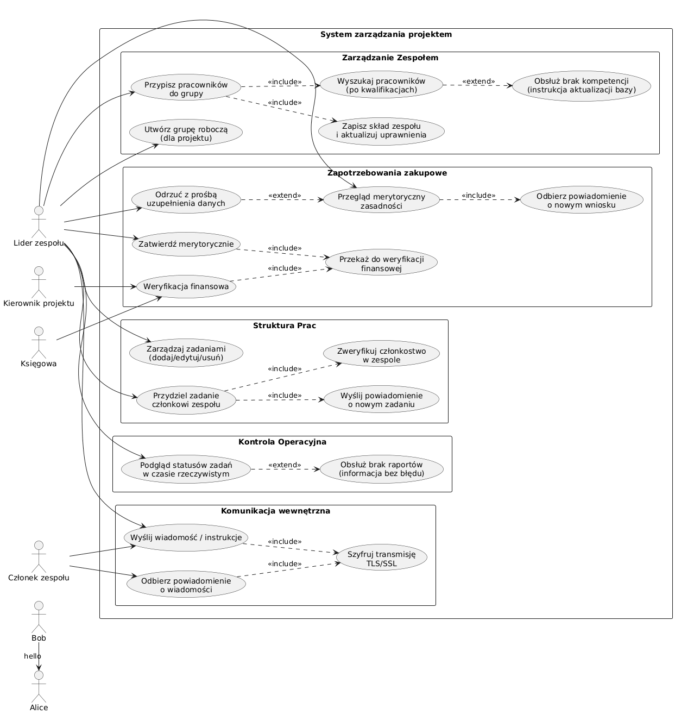
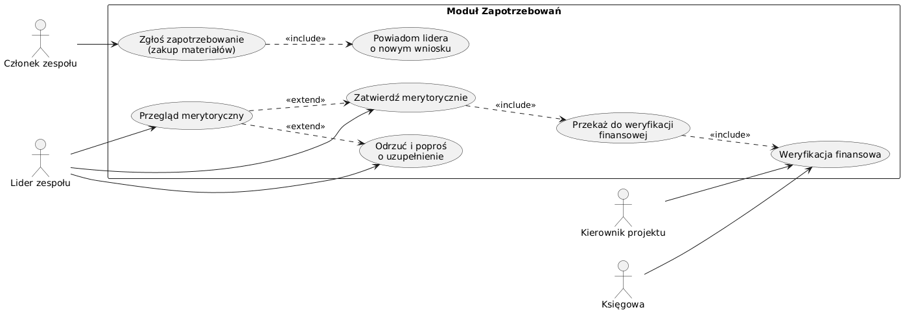
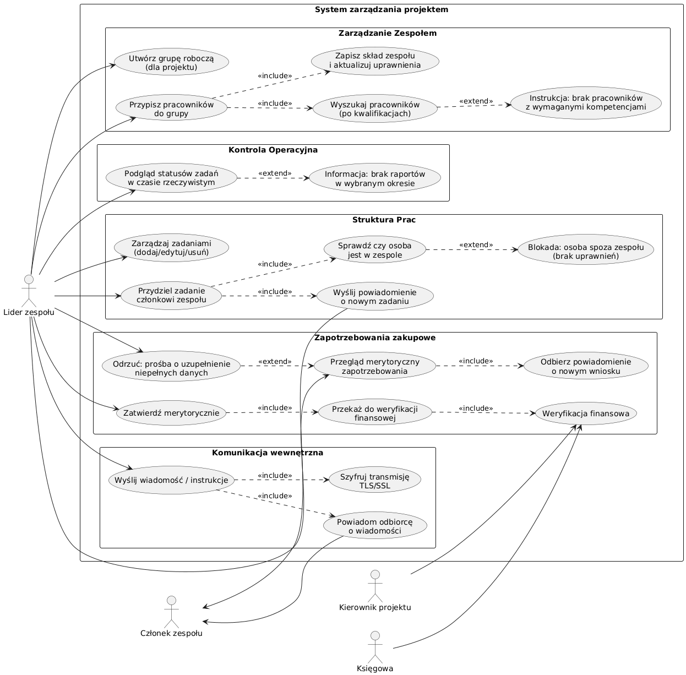

# Analiza Wymagań

## 1. Interesariusze

| L.p. | Interesariusz      | Opis                                                                                              |
|------|--------------------|---------------------------------------------------------------------------------------------------|
| 1.   | Opiekun/Dyrektor   | Rola ta koncentruje się na strategicznym nadzorze i analizie wyników w skali całej organizacji.   |
| 2.   | Kierownik projektu | Główny planista i osoba odpowiedzialna za merytoryczną oraz finansową stronę konkretnego badania. |
| 3.   | Lider zespołu      | Osoba zarządzająca ludźmi i koordynująca codzienne działania badawcze.                            |
| 4.   | Członek zespołu    | Bezpośredni wykonawca zadań, odpowiedzialny za dostarczanie merytorycznego wkładu w projekt.      |
| 5.   | Księgowa           | Osoba odpowiedzialna za poprawność finansową, rozliczenia oraz zgodność z przepisami.             |

## 2. Wymagania funkcjonalne 

### Opiekun/Dyrektor

- **(Wymagene) Nadzór nad portfelem projektów:** Możliwość monitorowania statusu wszystkich realizowanych projektów w systemie.

- **(Wymagene) Analiza finansowa:** Generowanie zbiorczych raportów kosztów dla wybranych projektów lub ich grup.

- **(Wymagene) Podgląd wyników:** Dostęp do podglądu wypracowanych rezultatów i efektów prac dostarczanych przez zespoły.

- **(Wymagene) Monitoring harmonogramów:** Wgląd w harmonogramy projektów w celu weryfikacji terminowości kluczowych etapów realizacji projektów.

- **(Wymagene) Akceptacja:** kamieni milowych oraz zatwierdzanie raportów końcowych przed ich wysłaniem do instytucji finansujących (np. grantodawców).

### Kierownik projektu

- **(Wymagene) Zarządzanie strukturą prac:** Dodawanie, edycja oraz usuwanie zadań w ramach struktury projektu.

- **(Wymagene) Planowanie czasowe:** Tworzenie i modyfikacja harmonogramu projektu.

- **(Wymagene) Zarządzanie zapotrzebowaniem:** Składanie wniosków o zakup sprzętu i materiałów niezbędnych do realizacji projektu.

- **(Wymagene) Planowanie budżetowe:** Wprowadzanie budżetu i precyzyjny podział środków na kategorie kosztowe, takie jak aparatura.

- **(Wymagene) Weryfikacja wydatków:** Przeglądanie szczegółów zamówień i ich akceptacja w ramach posiadanych uprawnień.

- **(Wymagene) Raportowanie operacyjne:** Generowanie raportów kosztów oraz postępów realizacji projektu w określonych zakresach czasowych.

### Księgowa

- **(Wymagene) Monitoring budżetu:** Stały podgląd aktualnego stanu budżetu, przydziału środków oraz ich wykorzystania.

- **(Wymagene) Zarządzanie dokumentacją kosztową** Rejestrowanie faktur i przypisywanie ich do odpowiednich projektów badawczych

- **(Wymagene) Realizacja płatności:** Obsługa procesów rozliczania i opłacania zweryfikowanych faktur

- **(Wymagene) Weryfikacja finansowa zamówień:** Sprawdzanie dostępności środków w budżecie przed ostateczną akceptacją zapotrzebowania na sprzęt

- **(Wymagene) Generowanie sprawozdań:** Tworzenie raportów finansowych z uwzględnieniem zrealizowanych zamówień i faktur

### Lider zespołu

- **(Wymagene) Formowanie zespołów:** Tworzenie grup roboczych oraz przypisywanie do nich odpowiednich pracowników

- **(Wymagene) Delegowanie odpowiedzialności:** Przydzielanie konkretnych zadań do zespołów oraz poszczególnych ich członków

- **(Średni) Kontrola operacyjna:** Bieżący podgląd statusu realizacji zadań przez podległych pracowników

- **(Wymagene) Weryfikacja merytoryczna potrzeb:** Przeglądanie i zatwierdzanie zapotrzebowania na materiały zgłoszonego przez członków zespołu przed przekazaniem go dalej.

- **(Wymagene) Komunikacja wewnętrzna:** Inicjowanie i prowadzenie sprawnej wymiany informacji między członkami projektu za pomocą systemu

- **(Wymagene) Zarządzanie strukturą prac:** Dodawanie, edycja oraz usuwanie zadań

### Członek zespołu

- **(Wymagene) Raportowanie postępów:** Przesyłanie wyników wykonanej pracy oraz aktualizacja statusów przypisanych zadań

- **(Wymagene) Obsługa powiadomień:** Odbieranie automatycznych komunikatów o nadchodzących terminach i zmianach w zadaniach

- **(Wymagene) Wymiana informacji:** Korzystanie z modułów komunikacyjnych do współpracy z innymi uczestnikami projektu

- **(Średni) Rejestrowania czasu:** Możliwość rejestrowania czasu pracy (time-tracking) poświęconego na konkretne eksperymenty lub analizy w ramach projektu

- **(Średni) Zarządzanie profilem** Edycja danych osobowych oraz aktualizacja bazy kwalifikacji i umiejętności

## 3. Wymagania niefunkcjonalne 

| L.p. | Opis                                                                                                                                                    |
|------|---------------------------------------------------------------------------------------------------------------------------------------------------------|
| 1    | **Dostępność i niezawodność** – System powinien być dostępny w trybie 24/7                                                                              |
| 2    | **Wydajność** - System musi reagować na akcje użytkownika w czasie poniżej 1 sekundy                                                                    |
| 3    | **Szyfrowanie** – Wszystkie dane muszą być szyfrowane zarówno podczas przesyłania (protokół TLS/SSL)                                                    |
| 4    | **Ochrona przed nieautoryzowanym dostępem** – System musi blokować dostęp do wrażliwych modułów (finanse, zamówienia) osobom bez odpowiednich uprawnień |
| 5    | **Skalowalność** – Architektura musi pozwalać na łatwe rozszerzanie zasobów (np. obsługę większej liczby projektów) oraz dodawanie nowych funkcjonalności bez konieczności przebudowy fundamentów systemu   |
| 6    | **Zgodność z prawem** – System musi być w pełni zgodny z RODO w zakresie ochrony danych osobowych oraz z przepisami prawa finansowego                   |
| 7    | **Standardy WCAG** –  Interfejs użytkownika (UI) musi być zaprojektowany zgodnie z wytycznymi WCAG, aby umożliwić komfortową pracę osobom z różnymi niepełnosprawnościami   |
| 8    | **Komunikacja z użytkownikiem** – Kod i struktura systemu powinny ułatwiać rozwój i konserwację |
| 9    | **Reakcja na brak danych:** – W sytuacjach, gdy dane w wybranym zakresie nie istnieją lub są niekompletne, system nie może wygenerować pustego błędu, lecz musi poinstruować użytkownika o konieczności zmiany zakresu lub uzupełnienia informacji  |

# 4. Specyfikacja przypadków użycia

## 1. Rola: Opiekun / Dyrektor

### Nadzór nad portfelem projektów
*   **Aktorzy:** Opiekun/Dyrektor
*   **Warunki początkowe:** Użytkownik zalogowany z uprawnieniami strategicznymi.
*   **Scenariusz główny:**
1. Użytkownik wybiera moduł „Portfel Projektów”.
2. System wyświetla listę wszystkich realizowanych projektów wraz z ich statusami.
3. Użytkownik filtruje projekty według statusu lub jednostki.
*   **Scenariusze alternatywne:**
*   A1: Brak projektów w systemie → System wyświetla komunikat o braku danych .

### Zbiorcza analiza finansowa
*   **Aktorzy:** Opiekun/Dyrektor
*   **Warunki początkowe:** Istnieją projekty z przypisanymi kosztami.
*   **Scenariusz główny:**
1. Użytkownik wybiera opcję „Raporty Finansowe”.
2. Użytkownik wskazuje grupę projektów do analizy.
3. System generuje raport zbiorczy kosztów.
*   **Scenariusze alternatywne:**
*   A1: Brak danych finansowych dla okresu → System instruuje o konieczności zmiany zakresu dat .

### Akceptacja kamieni milowych i raportów końcowych
*   **Aktorzy:** Opiekun/Dyrektor
*   **Warunki początkowe:** Kierownik projektu przedłożył raport lub kamień milowy do zatwierdzenia.
*   **Scenariusz główny:**
1. Użytkownik otwiera powiadomienie o oczekującej akceptacji.
2. Użytkownik przegląda rezultaty prac i efekty dostarczone przez zespół.
3. Użytkownik zatwierdza raport końcowy.
4. System zmienia status na „Zatwierdzony” i przygotowuje dane do wysyłki do instytucji finansującej.

###  Podgląd wypracowanych rezultatów i efektów prac
*   **Aktorzy:** Opiekun/Dyrektor
*   **Warunki początkowe:**
*   Użytkownik jest zalogowany do systemu.
*   Członkowie zespołów przesłali wyniki prac lub aktualizacje statusów w swoich projektach.
*   **Scenariusz główny:**
1. Użytkownik wybiera moduł „Rezultaty Projektów”.
2. System wyświetla listę projektów z informacją o najnowszych dostarczonych efektach (np. dokumentacja, analizy, prototypy).
3. Użytkownik wybiera konkretny projekt, aby przejrzeć szczegółowe wypracowane rezultaty.
4. System wyświetla podgląd plików lub opisów dostarczonych przez zespoły.
*   **Scenariusze alternatywne:**
*   A1: Brak przesłanych rezultatów dla wybranego okresu → System wyświetla komunikat o braku danych i instruuje użytkownika o konieczności zmiany parametrów wyszukiwania.
*   A2: Próba otwarcia pliku o dużym rozmiarze → System zapewnia reakcję interfejsu w czasie poniżej 1 sekundy (np. poprzez wyświetlenie paska postępu pobierania).

### Monitoring harmonogramów i weryfikacja terminowości
*   **Aktorzy:** Opiekun/Dyrektor
*   **Warunki początkowe:**
*   Użytkownik jest zalogowany do systemu.
*   Kierownicy projektów utworzyli harmonogramy i zdefiniowali kluczowe etapy (kamienie milowe).
*   **Scenariusz główny:**
1. Użytkownik wybiera moduł „Monitoring Harmonogramów”.
2. System wyświetla widok zbiorczy (np. wykres Gantta lub listę kamieni milowych) dla wszystkich projektów w portfelu.
3. Użytkownik filtruje widok, aby zidentyfikować projekty z zagrożonymi terminami lub opóźnieniami w kluczowych etapach.
4. System wyróżnia (np. kolorem) etapy, których termin realizacji upłynął bez zmiany statusu na „Zakończone”.
5. Użytkownik weryfikuje stopień zaawansowania prac w stosunku do planu.
*   **Scenariusze alternatywne:**
*   A1: Harmonogram projektu nie został jeszcze zdefiniowany → System informuje użytkownika, że Kierownik Projektu nie wprowadził jeszcze planu czasowego.
*   A2: Brak uprawnień do szczegółowego harmonogramu wrażliwego projektu → System blokuje dostęp i wyświetla informację o braku odpowiednich uprawnień.
---
## 2. Rola: Kierownik Projektu

### Zarządzanie strukturą prac i harmonogramem
*   **Aktorzy:** Kierownik projektu
*   **Warunki początkowe:**
*   Użytkownik zalogowany do systemu.
*   Projekt został zainicjowany w systemie.
*   **Scenariusz główny:**
1. Użytkownik wybiera moduł zarządzania projektem.
2. Użytkownik dodaje, edytuje lub usuwa zadania w strukturze projektu.
3. Użytkownik definiuje ramy czasowe dla zadań, tworząc lub modyfikując harmonogram.
4. System aktualizuje widok struktury prac i plan czasowy.
*   **Scenariusze alternatywne:**
*   A1: Błędne daty (np. zakończenie przed rozpoczęciem) → System wyświetla komunikat o błędzie i nie zapisuje zmian.
*   A2: Brak uprawnień do edycji struktury → System blokuje dostęp do modułu.

## 2. Rola: Kierownik Projektu

### Zarządzanie strukturą prac i harmonogramem
*   **Aktorzy:** Kierownik projektu
*   **Warunki początkowe:**
*   Użytkownik zalogowany do systemu.
*   Projekt został zainicjowany w systemie.
*   **Scenariusz główny:**
1. Użytkownik wybiera moduł zarządzania projektem.
2. Użytkownik dodaje, edytuje lub usuwa zadania w strukturze projektu.
3. Użytkownik definiuje ramy czasowe dla zadań, tworząc lub modyfikując harmonogram.
4. System aktualizuje widok struktury prac i plan czasowy.
*   **Scenariusze alternatywne:**
*   A1: Błędne daty (np. zakończenie przed rozpoczęciem) → System wyświetla komunikat o błędzie i nie zapisuje zmian.
*   A2: Brak uprawnień do edycji struktury → System blokuje dostęp do modułu.

### Monitorowanie kluczowych etapów (Kamienie milowe)
*   **Aktorzy:** Kierownik projektu, Opiekun/Dyrektor
*   **Warunki początkowe:**
*   Zdefiniowano kamienie milowe w harmonogramie.
*   **Scenariusz główny:**
1. Użytkownik weryfikuje terminowość realizacji kluczowych etapów projektu.
2. Po zakończeniu etapu, użytkownik przygotowuje raport końcowy lub informację o osiągnięciu kamienia milowego do akceptacji przez Dyrektora.
3. System przesyła powiadomienie o gotowości do akceptacji do odpowiedniego interesariusza.

## 3. Rola: Lider Zespołu

### Formowanie zespołów i grup roboczych
*   **Aktorzy:** Lider zespołu
*   **Warunki początkowe:**
*   Użytkownik jest zalogowany do systemu.
*   W systemie dostępna jest baza pracowników z ich kwalifikacjami.
*   **Scenariusz główny:**
1. Użytkownik wybiera moduł „Zarządzanie Zespołem”.
2. Użytkownik tworzy nową grupę roboczą przypisaną do konkretnego projektu.
3. Użytkownik wyszukuje odpowiednich pracowników i przypisuje ich do grupy.
4. System zapisuje skład zespołu i aktualizuje uprawnienia członków.
*   **Scenariusze alternatywne:**
*   A1: Brak dostępnych pracowników o wymaganych kompetencjach → System wyświetla instrukcję o konieczności aktualizacji bazy kwalifikacji.

---

### Zarządzanie strukturą prac i delegowanie zadań
*   **Aktorzy:** Lider zespołu
*   **Warunki początkowe:**
*   Istnieje aktywny projekt ze strukturą prac.
*   **Scenariusz główny:**
1. Użytkownik otwiera moduł „Struktura Prac”.
2. Użytkownik dodaje nowe zadania, edytuje istniejące lub usuwa zbędne elementy.
3. Użytkownik przydziela konkretne zadania do poszczególnych członków zespołu.
4. System przesyła automatyczne powiadomienie do pracownika o nowym zadaniu.
*   **Scenariusze alternatywne:**
*   A1: Próba przypisania zadania osobie spoza zespołu → System blokuje akcję i wyświetla komunikat o braku uprawnień.

---

### Kontrola operacyjna i monitoring statusów
*   **Aktorzy:** Lider zespołu
*   **Warunki początkowe:**
*   Członkowie zespołu raportują postępy w swoich zadaniach.
*   **Scenariusz główny:**
1. Użytkownik wybiera widok „Kontrola Operacyjna”.
2. System wyświetla bieżący status realizacji wszystkich zadań podległych pracowników w czasie rzeczywistym (reakcja < 1s).
3. Użytkownik weryfikuje stopień zaawansowania prac merytorycznych.
*   **Scenariusze alternatywne:**
*   A1: Brak zaraportowanych postępów w wybranym okresie → System nie generuje błędu, lecz instruuje o braku danych od zespołu.

---

### Weryfikacja merytoryczna zapotrzebowania
*   **Aktorzy:** Lider zespołu, Kierownik projektu, Księgowa
*   **Warunki początkowe:**
*   Członek zespołu zgłosił potrzebę zakupu materiałów.
*   **Scenariusz główny:**
1. Użytkownik otrzymuje powiadomienie o nowym wniosku merytorycznym.
2. Użytkownik przegląda szczegóły zapotrzebowania pod kątem zasadności badawczej.
3. Użytkownik zatwierdza wniosek merytoryczny.
4. System przekazuje wniosek do dalszej weryfikacji finansowej przez Kierownika lub Księgową.
*   **Scenariusze alternatywne:**
*   A1: Wniosek zawiera niepełne dane merytoryczne → Lider odrzuca wniosek z prośbą o uzupełnienie informacji.

---

### Komunikacja wewnętrzna i wymiana informacji
*   **Aktorzy:** Lider zespołu, Członek zespołu
*   **Warunki początkowe:**
*   Użytkownicy są przypisani do tego samego projektu.
*   **Scenariusz główny:**
1. Użytkownik inicjuje wymianę informacji poprzez systemowy moduł komunikacyjny.
2. Użytkownik przesyła wiadomość lub instrukcje do członka zespołu.
3. System szyfruje przesyłane dane protokołem TLS/SSL.
4. Odbiorca otrzymuje powiadomienie o nowej wiadomości.

